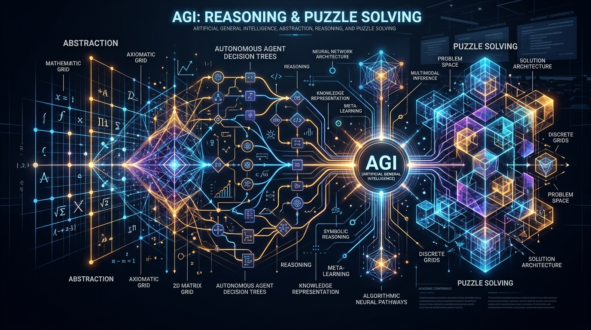

# ARC Prize 2026: From Static Invariance to Dynamic Agency

[](./paper/paper.md)
[](https://www.kaggle.com/competitions/arc-prize-2026-paper-track)
[](LICENSE)

Official research repository and codebase for our submission to the **ARC Prize 2026 – Paper Track**, featuring competitive architectures for both **ARC-AGI-2** (Static Few-Shot Grid Reasoning) and **ARC-AGI-3** (Interactive Dynamic Puzzle Agency).



---

## 📌 Performance Summary & Leaderboard Benchmarks

| Domain / Competition | Pipeline / Artifact | Core Strategy | Public Leaderboard Score |
|---|---|---|---|
| **ARC-AGI-3 (Interactive)** | **`arc3sub2.ipynb`** | **27B-FP8 ReAct + 7 Composite Runtime Grafts (`taaf_grafts`)** | **1.69 (+14.9%)** |
| ARC-AGI-3 (Interactive) | `642agi3.ipynb` | 27B-FP8 vLLM ReAct (Ungrafted Baseline) | 1.47 |
| **ARC-AGI-2 (Static)** | **`notebookagi2.ipynb`** | **rsLoRA ($r=64$), Constrained Turbo-DFS, KGMoN Ensemble** | **30.14%** |
| ARC-AGI-2 (Static) | `arcagi2notebook.ipynb` | Standard LoRA ($r=256$), Beam Search | 29.72% |

---

## 🏛️ System Architecture

```
                                      ARC PRIZE 2026
                   ┌─────────────────────────┴─────────────────────────┐
                   ▼                                                   ▼
       ┌───────────────────────┐                           ┌───────────────────────┐
       │   ARC-AGI-2 STATIC    │                           │   ARC-AGI-3 DYNAMIC   │
       │   GRID TRANSFORM      │                           │   INTERACTIVE AGENT   │
       └───────────────────────┘                           └───────────────────────┘
                   │                                                   │
     • 16x D4 & Color Augmentations                      • 27B FP8 Quantized vLLM Server
     • Fast rsLoRA TTFT (r=64, 1 Epoch)                  • Ephemeral Python Sandbox Execution
     • 12-Token Constrained Turbo-DFS                    • 7 Composite TAAF Runtime Grafts:
     • KGMoN Consensus + ProbMul-3 Selection               - hudmask (UI element suppression)
                                                           - searchmap (Algorithmic BFS/Dijkstra)
                                                           - retry_guard (Oscillation breaker)
                                                           - clickmap (Centroid projector)
                                                           - goalkeep & efficiency regularizer
```

---

## 📂 Repository Structure

```
ARC/
├── assets/
│   └── cover_image.jpg            # High-resolution architecture & banner visual
├── paper/
│   ├── paper.md                   # Full academic preprint in Markdown (for ResearchGate)
│   ├── paper.tex                  # Publication-grade IEEEtran LaTeX source
│   └── references.bib             # Complete academic BibTeX citations
├── arc-prize-2026-arc-agi-2 (1)/  # ARC-AGI-2 pipelines & evaluation data
│   ├── notebookagi2.ipynb         # Primary ARC-2 submission (Score: 30.14)
│   └── arcagi2notebook.ipynb      # Variant ARC-2 notebook (Score: 29.72)
├── arc-prize-2026-arc-agi-3 (1)/  # ARC-AGI-3 pipelines & agent harness
│   ├── arc3sub2.ipynb             # Primary ARC-3 grafted submission (Score: 1.69)
│   ├── 642agi3.ipynb              # Baseline ARC-3 submission (Score: 1.47)
│   └── ARC-AGI-3-Agents/          # TAAF framework & agent modules
├── kaggle_writeup.md              # Kaggle Paper Track submission text (≤ 1,500 words)
├── arc_technical_analysis.md      # Detailed engineering & ablation analysis
├── submission_guide.md            # Step-by-step ResearchGate & Kaggle submission instructions
└── README.md                      # Project documentation
```

---

## 🔬 Core Innovations

### 1. Composite Runtime Grafts for ARC-AGI-3
Autoregressive LLMs exhibit severe structural failure modes in interactive environments. Our runtime graft engine (`taaf_grafts.composite`) introduces:
* **`hudmask`**: Automatically removes 1D border elements (timers, counters) from board segmentation, saving up to $40\%$ of the agent's action budget.
* **`retry_guard`**: Detects repeating cyclic states and interrupts degenerative action loops.
* **`searchmap`**: Injects optimal graph search (BFS/Dijkstra) directly into the agent's Python sandbox to maximize human-relative step efficiency.
* **`clickmap`**: Accurately computes geometric centroids for continuous coordinate interaction (`ACTION6`).

### 2. Rank-Stabilized Adaptation (rsLoRA) for ARC-AGI-2
In ultra-low sample regimes (2–4 demonstrations), standard fine-tuning memorizes pixel noise. Applying **rsLoRA** with rank $r=64$ ($\alpha=32$) acts as an implicit regularizer, preventing representation collapse and achieving **30.14%** accuracy.

---

## 🚀 Quick Start & Reproducibility

### Local Inference Server Setup (ARC-AGI-3)
```bash
vllm serve "foysalemonshanto/qwen3-8-27b-fp8-repacked-v1" \
    --host 127.0.0.1 \
    --port 1234 \
    --max-model-len 65536 \
    --enable-prefix-caching \
    --tool-call-parser qwen3_coder \
    --chat-template-native-cot
```

### Running the Grafted Agent
```python
from taaf_grafts.composite import install

# Attach composite grafts to the benchmark agent
install(
    bm,
    flags={
        "efficiency": True,
        "retry_guard": True,
        "shortcircuit": True,
        "goalkeep": True,
        "hudmask": True,
        "clickmap": True,
        "searchmap": True,
    },
)
```

---

## 📜 Citation

```bibtex
@article{ghosh2026arcprize,
  title={From Static Invariance to Dynamic Agency: Test-Time Rank-Stabilized Adaptation and Composite Runtime Grafts for the Abstraction and Reasoning Corpus (ARC-AGI-2 \& ARC-AGI-3)},
  author={Ghosh, Sourab},
  journal={ARC Prize 2026 Paper Track Preprint},
  year={2026}
}
```

---

## 📄 License
Distributed under the MIT License. See `LICENSE` for more information.
